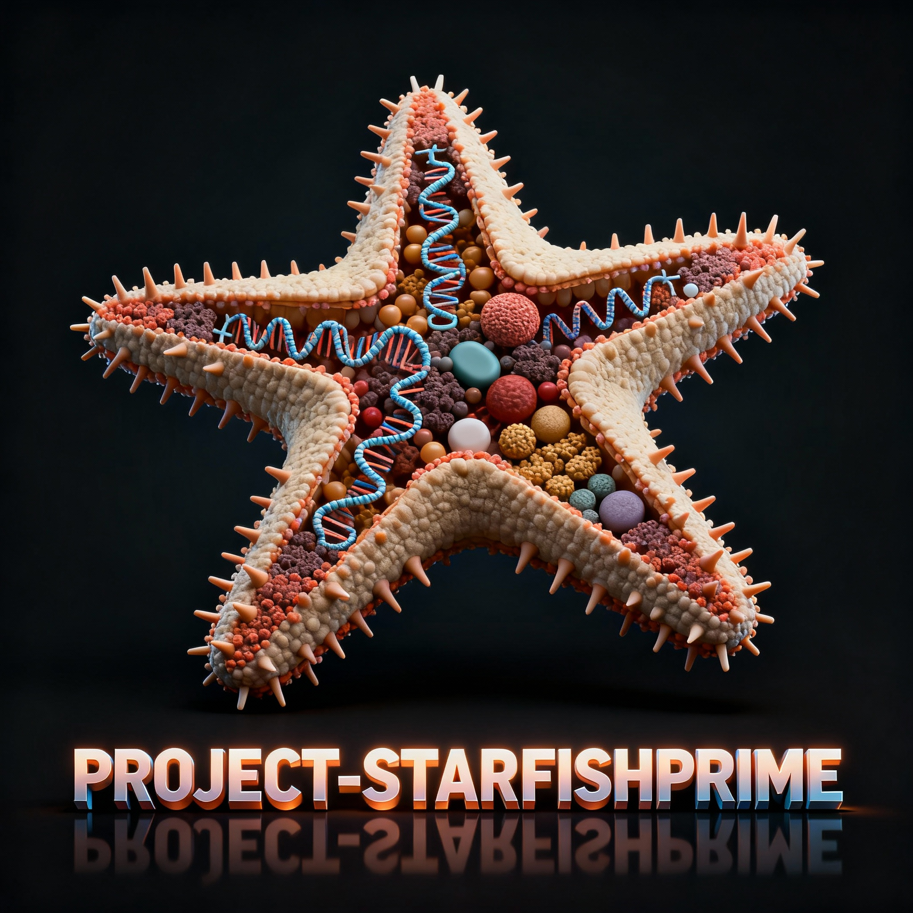

# PROJECT_STARFISHPRIME

Data platform for air quality + ILI forecasting.

## Structure
- `ingestion_pipeline_AQ`: OpenAQ recent + backfill
- `ingestion_pipeline_delphi`: FluView weekly upsert
- `transformation/dbt`: silver/gold models + seeds
- `ml-model`: training, batch predict, optional FastAPI
- `utils`: shared helpers
- `.github/workflows`: CI + optional deploy

## Quickstart
1. `python -m venv .venv && .\.venv\Scripts\Activate.ps1`
2. `pip install -r ml-model/requirements.txt`
3. `python ingestion_pipeline_AQ/ingestion_openaq.py`
